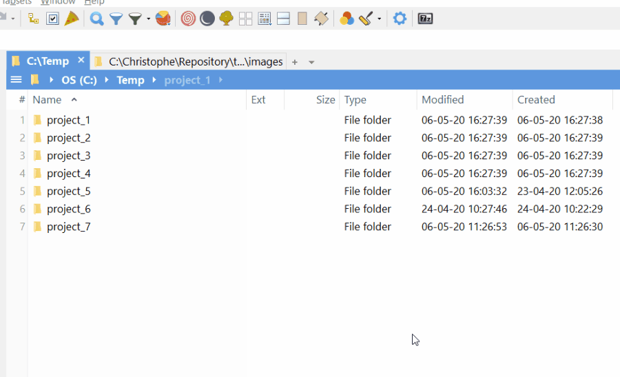

# ArchiveSelectedFiles

Add a custom button that will allow you to create an archive of the selected files/folder.

You can select one or more folder and the script will create one ZIP by selected folder as you can see in the illustration below

