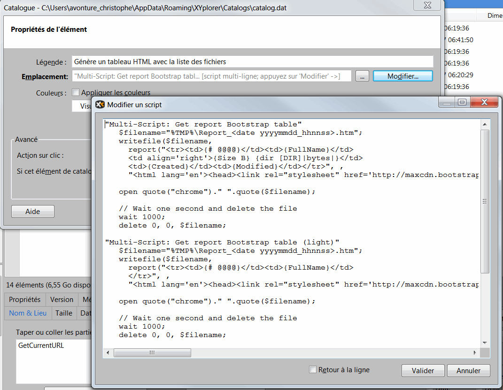

# xyPlorer - Generates an html file with the list of files

In the catalog, create a new entry (see image below).  Click on the Edit button and copy the code below.

```text
"Multi-Script: Get report Bootstrap table"
   $filename="%TMP%\Report_<date yyyymmdd_hhnnss>.htm";
   writefile($filename,

     report("<tr><td>{# @@@@}</td><td>{FullName}</td>
     <td align='right'>{Size B} {dir [DIR]|bytes|}</td>
     <td>{Created}</td><td>{Modified}</td></tr>", ,
     "<html lang='en'><head><link rel="stylesheet" href='http://maxcdn.bootstrapcdn.com/bootstrap/3.2.0/css/bootstrap.min.css'></head><body><table class='table table-striped' cellpadding='4'><thead><tr><th>#</th><th>Filename</th><th>Size</th><th>Creation date/time</th><th>Last modification date/time</th></tr></thead><tbody>", "</tbody></table></body></html>"));

   open quote("chrome")." ".quote($filename);

   // Wait one second and delete the file
   wait 1000;
   delete 0, 0, $filename;

"Multi-Script: Get report Bootstrap table (light)"
   $filename="%TMP%\Report_<date yyyymmdd_hhnnss>.htm";
   writefile($filename, 
     report("<tr><td>{# @@@@}</td><td>{FullName}</td>
     </tr>", ,
     "<html lang='en'><head><link rel="stylesheet" href='http://maxcdn.bootstrapcdn.com/bootstrap/3.2.0/css/bootstrap.min.css'></head><body><table class='table table-striped' cellpadding='4'><thead><tr><th>#</th><th>Filename</th></tr></thead><tbody>", "</tbody></table></body></html>"));

   open quote("chrome")." ".quote($filename);

   // Wait one second and delete the file
   wait 1000;
   delete 0, 0, $filename;

"Multi-Script: Liste numérotée"
   $filename="%TMP%\Report_<date yyyymmdd_hhnnss>.htm";
   writefile($filename, 
     report("<li>{FullName}</li>", ,
     "<html lang='en'><head><link rel="stylesheet" href='http://maxcdn.bootstrapcdn.com/bootstrap/3.2.0/css/bootstrap.min.css'></head><body><ol>", "</ol></body></html>"));

   open quote("chrome")." ".quote($filename);

   // Wait one second and delete the file
   wait 1000;
   delete 0, 0, $filename;
```


