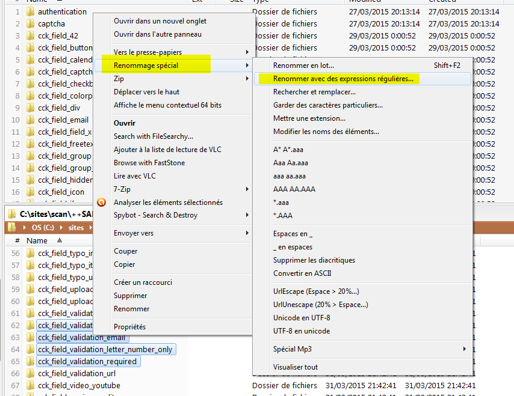

# xyPlorer - Tips & Tricks - Batch Rename Files

## Replace one value with another ##

xyPlorer allows you to rename hundreds of files on the fly in the simplest way.

Imagine that you have files with a clearly identifiable `pattern` in the filename, e.g. a : *you want to replace the number 310 in the filename with 789*

So you have files with these names:

* `C:\data\RTD310A-001-001A.txt`
* `C:\data\RTD310A-001-001B.txt`
* `C:\data\RTD310A-001-001C.txt`
* `C:\data\RTD310A-001-001D.txt`
* `C:\data\RTD310A-001-001E.txt`

and you want

* `C:\data\RTD789A-001-001A.txt`
* `C:\data\RTD789A-001-001B.txt`
* `C:\data\RTD789A-001-001C.txt`
* `C:\data\RTD789A-001-001D.txt`
* `C:\data\RTD789A-001-001E.txt`

With xyPlorer, this is done in a single operation: 

1. Go to the folder that contains the files you want to rename
2. Click on the `File` menu
3. Select `Special Renaming`.
4. Choose `Search and Replace`.
5. In the window that appears, at the bottom left, you have a small "i" of information to get help. You will learn that the syntax is `old/new`, so just type "310/789". (search for pattern 310 and replace with 789).
6. Click on the `View` button to see what it looks like and just `validate` the old renaming action.

## Take out a prefix

Expression: `^cck_ >`

FIND
`^` = start of file name
`cck_` = pattern to find (here, prefix to remove)

REPLACE
= All of the following > is what should be replaced.   When `cck_` is found, it is replaced by `...`
by putting nothing, so we say that the prefix should be removed.

Running `^cck_ >` removes the prefix from the selected files.
