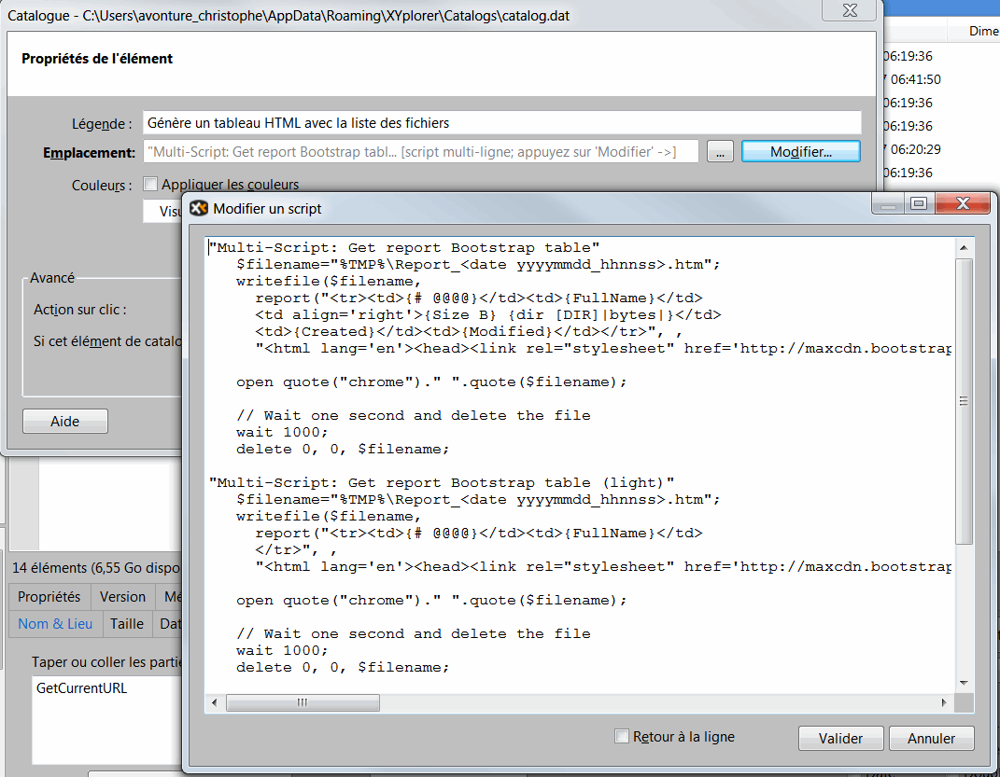

<!-- This file has been generated by the concat-md.ps1 script. -->
<!-- Don't modify this file manually (you'll loose your changes) -->
<!-- but run the tool once more -->

<!-- Last refresh date: 2021-03-22 10:52:53 -->

<!-- below, content of ./index.md -->

# Repository with tips & tricks for the tremendous XYplorer Windows software

<!-- table-of-contents - start -->
* [Tutorial](#tutorial)
  * [XYplorer - Keyboard shortcuts](#xyplorer-keyboard-shortcuts)
* [Scripts](#scripts)
  * [ArchiveSelectedFiles](#archiveselectedfiles)
  * [xyPlorer - Generates an html file with the list of files](#xyplorer-generates-an-html-file-with-the-list-of-files)
  * [xyPlorer - Tips & Tricks - Batch Rename Files](#xyplorer-tips-&-tricks-batch-rename-files)
    * [Replace one value with another ##](#replace-one-value-with-another-)
    * [Take out a prefix](#take-out-a-prefix)
* [Visual Studio Code](#visual-studio-code)
* [License](#license)
<!-- table-of-contents - end -->

 [XYplorer](https://www.xyplorer.com/) is an amazing explorer for Windows.  Something like "Windows Explorer" but no, the comparison can't be done in fact (we can’t compare a commodore 64 with a recent computer).

[XYplorer](https://www.xyplorer.com/) is a tool that let you to work very efficiently.

One of my favorite function is the “Branch view” (“liste applatie” in French), allowing you to view every files just like if there were in one folder.

<!-- below, content of ./010-tutorial/readme.md -->

## Tutorial

<!-- below, content of ./010-tutorial/keyboard-shortcuts/readme.md -->

### XYplorer - Keyboard shortcuts

* `CTRL-ALT-J` - **Filter files based on an extension** Selecting a file type (e.g. a PDF file) and `CTRL-ALT-J` will activate filter mode on that extension.
* `CTRL-ALT-M` - **Select files based on an extension** Selecting a file type (e.g. a PDF file) and `CTRL-ALT-M` will select all files with the same extension.
* `CTRL-ALT-N` - **Create new folder structure** Creates a folder and its subfolders at once (relative or absolute). For example: `DIRA\DIRB\DIRC` is entered and the three directories are created and the last one is immediately opened. `CTRL-ALT-N`
* `CTRL-ALT-V` - **Paste text into new file** Copying text into the clipboard then `CTRL-ALT-V` will automatically generate a new text file with the clipboard contents in it.
* `CTRL-B` - **Put folder into the Favorites Folder list** `CTRL-B`.
* `CTRL-F8` - **Show Catalog** The catalog is a set of structured links; links can contain shortcuts to folders/files, but also URLs or `CTRL-F8` scripts.
* `CTRL-Q` or `F11` - **Preview**
* `CTRL-SHIFT-F7` - **Select a set of files, press `CTRL-SHIFT-F7` and there it is possible to define the target directory (which can be dynamically named). A copy of the files will then be made to this folder.  Files already in this folder, unmodified, will be skipped.
* `CTRL-SHIFT-I` - **Invert selection** `CTRL-SHIFT-I`.
* `CTRL-SHIFT-P` - **Copy absolute filenames in the clipboard** Select a set of files and `CTRL-P` allows to copy the absolute filenames of those files to the clipboard, `CTRL-SHIFT-P` for just the filename (without folder name).
* `CTRL-SHIFT-X` - **Move files to a new subfolder** Select files and press `CTRL-SHIFT-X` to be offered a new folder.
* `F10` - **Double breadcrumbs (switch)** `F10`.
* `F12` - **Show properties pane** Displays the lower part of the screen with the different properties of the selected element `F12`.

<!-- below, content of ./020-scripts/readme.md -->

## Scripts

<!-- below, content of ./020-scripts/ArchiveSelectedFiles/readme.md -->

### ArchiveSelectedFiles

Add a custom button that will allow you to create an archive of the selected files/folder.

You can select one or more folder and the script will create one ZIP by selected folder as you can see in the illustration below

<!-- below, content of ./020-scripts/MakeHtmlTableListOfFiles/readme.md -->

### xyPlorer - Generates an html file with the list of files

In the catalog, create a new entry (see image below).  Click on the Edit button and copy the code below.

<!-- below, content of ./030-batch/rename/readme.md -->

### xyPlorer - Tips & Tricks - Batch Rename Files

#### Replace one value with another ##

xyPlorer allows you to rename hundreds of files on the fly in the simplest way.

Imagine that you have files with a clearly identifiable `pattern` in the filename, e.g. a : *you want to replace the number 310 in the filename with 789*

So you have files with these names:

* `C:\data\RTD310A-001-001A.txt`
* `C:\data\RTD310A-001-001B.txt`
* `C:\data\RTD310A-001-001C.txt`
* `C:\data\RTD310A-001-001D.txt`
* `C:\data\RTD310A-001-001E.txt`

and you want

* `C:\data\RTD789A-001-001A.txt`
* `C:\data\RTD789A-001-001B.txt`
* `C:\data\RTD789A-001-001C.txt`
* `C:\data\RTD789A-001-001D.txt`
* `C:\data\RTD789A-001-001E.txt`

With xyPlorer, this is done in a single operation:

1. Go to the folder that contains the files you want to rename
2. Click on the `File` menu
3. Select `Special Renaming`.
4. Choose `Search and Replace`.
5. In the window that appears, at the bottom left, you have a small "i" of information to get help. You will learn that the syntax is `old/new`, so just type "310/789". (search for pattern 310 and replace with 789).
6. Click on the `View` button to see what it looks like and just `validate` the old renaming action.

#### Take out a prefix

Expression: `^cck_ >`

FIND
`^` = start of file name
`cck_` = pattern to find (here, prefix to remove)

REPLACE
= All of the following > is what should be replaced.   When `cck_` is found, it is replaced by `...`
by putting nothing, so we say that the prefix should be removed.

Running `^cck_ >` removes the prefix from the selected files.

<!-- below, content of ./080-vscode/readme.md -->

## Visual Studio Code

> [XYplorer language support for VS Code](https://github.com/cavo789/tools_xyplorer.git)

<!-- below, content of ./999-License/readme.md -->

## License

[MIT](LICENSE)
